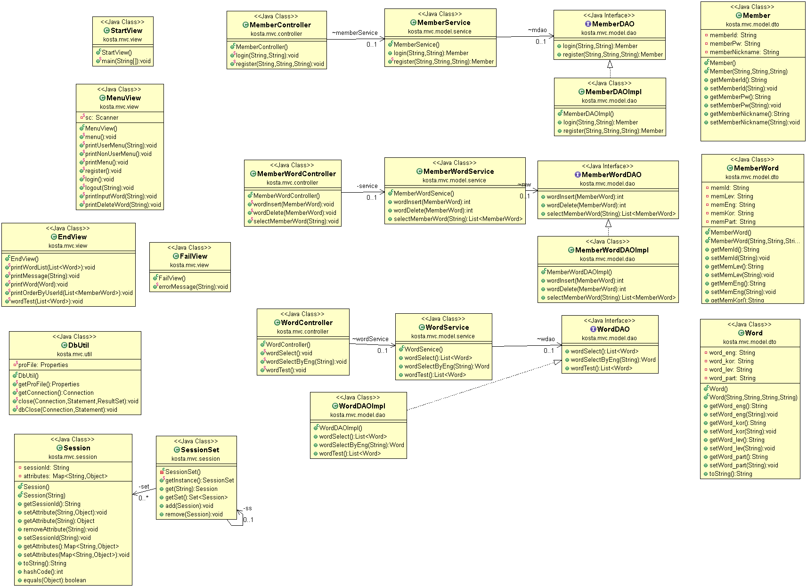

  
  <h1 align="center">잊혀질 단어장</h3>

## 1. 프로젝트 개요도
**프로젝트 명:**   `잊혀질 단어장` 
**프로젝트 개요:** `영어 단어를 학습하고 간단한 시험을 통해 평가한다. 이 후 틀린 문제들을 수집하여 개인별 오답노트를 생성하고 사용자별로 순위를 매긴다.` 
**주요기능:**      `영어 단어 학습 및 평가` 
**구성원:**        `박세진, 박동주, 박유진, 최윤우` 

#### Editing...
